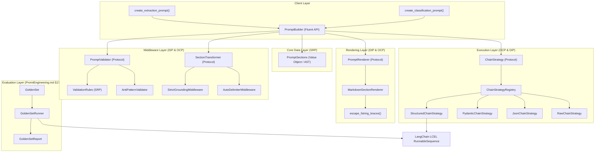

# System Architecture & SOLID Design

PromptSight is engineered as a modular, extensible framework built on top of `langchain-core` and `pydantic`. It enforces the 22-section engineering specification ([`docs/spec.md`](../spec.md)) while maintaining a clean, decoupled Python architecture.

---

## 🏛️ High-Level Component Architecture

---

## 🎯 How SOLID Principles Are Applied

### 1. Single Responsibility Principle (SRP)
- **`PromptSections`** ([`src/promptsight/sections.py`](../../src/promptsight/sections.py)): Acts exclusively as a pure data value object representing the prompt's logical sections. It has zero rendering or string formatting responsibilities.
- **`PromptRenderer`** ([`src/promptsight/renderers/`](../../src/promptsight/renderers/)): Dedicated exclusively to compiling `PromptSections` into concrete template string syntax.
- **`ValidationRule`** ([`src/promptsight/middleware/rules.py`](../../src/promptsight/middleware/rules.py)): Each anti-pattern check is isolated in its own single-purpose class (`RoleAndGoalRule`, `TaskClarityRule`, `OutputFormatRule`, `ConstraintsStyleRule`, `VerificationChecklistRule`).

### 2. Open/Closed Principle (OCP)
- **Extensible Validation Rules**: Developers can create custom linting rules without modifying existing classes. Pass rules into `AntiPatternValidator(rules=[CustomRule()])`.
- **Extensible Chain Strategies**: The LCEL bridge does not use hardcoded `if/elif` statements. New strategies can be registered at runtime with `register_chain_strategy("name", CustomStrategy())` or injected directly via `builder.to_chain(mode=CustomStrategy())`.
- **Extensible Renderers**: Renderers can be replaced (e.g. `XMLPromptRenderer`, `JSONPromptRenderer`) via `builder.with_renderer(...)`.

### 3. Liskov Substitution Principle (LSP)
- All concrete renderers, strategies, validation rules, and middleware components strictly adhere to Python `Protocol` contracts. Any implementation can replace the default without type casting or runtime side effects.

### 4. Interface Segregation Principle (ISP)
- Rather than forcing one monolithic `Middleware` interface with dummy methods, PromptSight segregates interfaces into:
  - **`SectionTransformer`**: Defines only `transform(sections) -> PromptSections`
  - **`PromptValidator`**: Defines only `validate(sections) -> List[ValidationIssue]`
- `PromptBuilder.use()` dynamically detects which capabilities a component provides and attaches it to the appropriate internal pipeline.

### 5. Dependency Inversion Principle (DIP)
- `PromptBuilder` depends entirely on high-level abstractions:
  - It depends on the `PromptRenderer` protocol, not a concrete markdown string generator.
  - It depends on the `ChainStrategy` protocol, not concrete LangChain model bindings.
